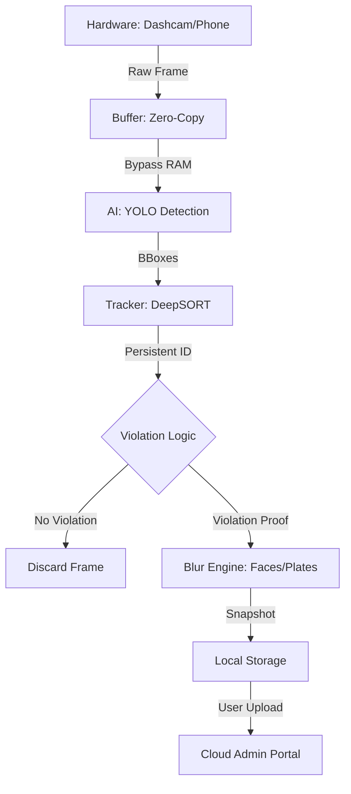

# RoadSense AI: System Architecture

RoadSense AI is a decentralized, edge-first road safety enforcement network. It is designed to transform existing mobile and dashcam hardware into intelligent sensors that detect violations locally and report them securely.

## 🏗️ High-Level Component Overview

The system is divided into four distinct layers, ensuring that data processing remains close to the source while enforcement remains centralized.

### 1. The Edge Layer (Hardware & OS)
*   **Sensor Nodes**: Existing Dashcams (via USB-C, Bluetooth, or Local Wi-Fi).
*   **Always-On Recording**: Unlike phones, Dashcams are triggered by the vehicle's ignition (ACC power). As soon as the car starts, the AI engine boots up.
*   **Smart Connectivity (Smart-Bulb Style)**:
    *   **Bluetooth (BLE)**: Used for initial "handshake" and easy device discovery.
    *   **Local Wi-Fi (AP Mode)**: The Dashcam acts as a local hotspot or connects to your car's Wi-Fi, mirroring the "Smart Bulb" experience for instant frame preview and configuration.
*   **Zero-Copy Ingestion**: The video frame is pulled from the hardware buffer directly into the AI pipeline, bypassing general RAM to prevent heat buildup.

### 2. The Processing Layer (AI & Local Server)
*   **Neural Engine**: Distilled YOLOv8n (45MB) optimized for edge NPCs/GPUs.
*   **Tracker**: DeepSORT (Simple Online and Realtime Tracking) with a Kalman filter to maintain vehicle identity across frames.
*   **Violation Logic**: A mathematical state machine that tracks movement vectors (e.g., if "Track ID 42" moves $> 20px$ in the wrong Y-direction, it triggers a violation).
*   **Local Flask Server**: Acts as the "Brain" of the device, managing local API routes for the frontend dashboard and handling the tracking state.

### 3. The Security & Sync Layer (Privacy Gateway)
*   **Selective Buffer**: The system only saves snapshots when a violation is mathematically proven. It does *not* save continuous video footage unless configured for standard DVR recording.
*   **Neural Distillation**: The core 20GB intelligence is compressed into 45MB using Weight Pruning and INT8 Quantization.
*   **Secure Push Model**: The device remains invisible to the internet. It only initiates a TLS-encrypted handshake to the Admin Portal when a violation is ready for upload.

### 4. The Cloud Layer (Admin & Central Enforcement)
*   **Relay Service**: Receives encrypted violation packets.
*   **Validation Engine**: Secondary AI verification to prevent false positives.
*   **Challan Portal**: Integration with government databases for automated fine issuance.

## 🔄 Data Flow: The Frame Lifecycle

## 📈 Performance & Resource Management
*   **CPU/GPU Triage**: The AI runs on a separate thread. If the hardware gets warm, the system drops the inference rate (e.g., 30fps to 15fps) to keep the UI at 60fps.
*   **INT8 Quantization**: Reduces math complexity by 4x, allowing smooth execution even on 4-year-old hardware.
